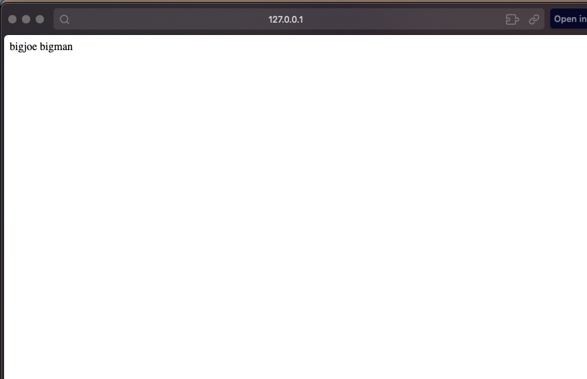
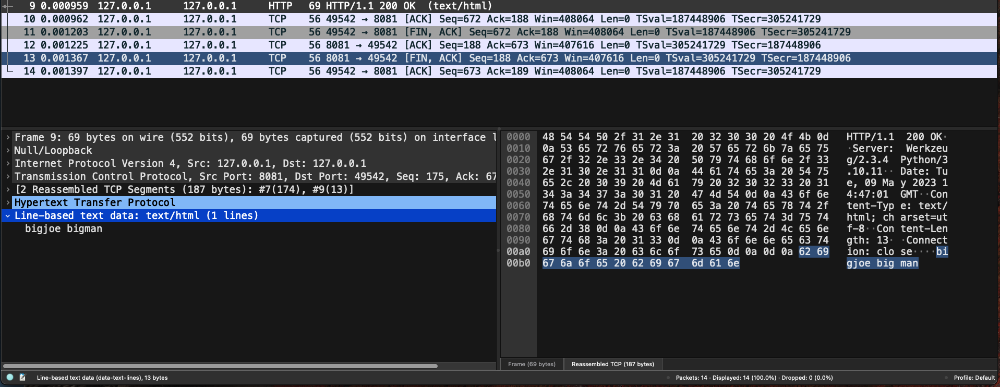
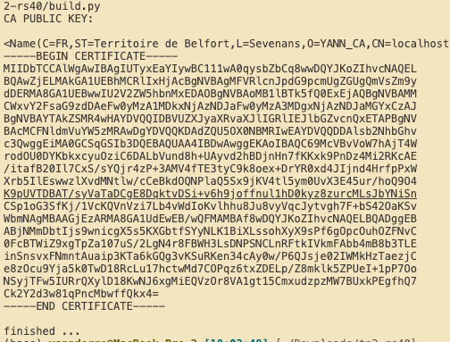
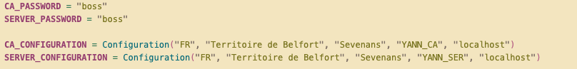
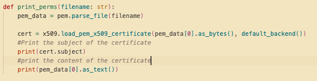
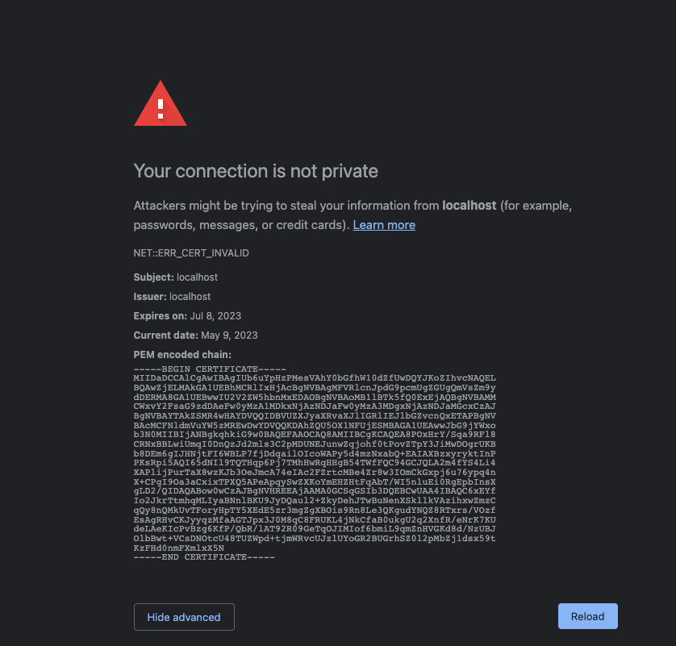
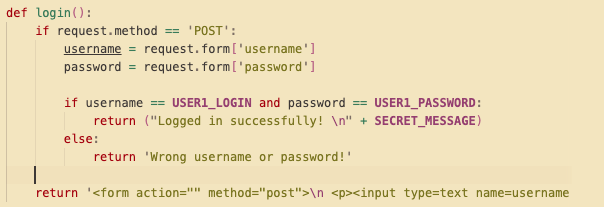
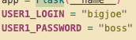

# RS40 TP2 / yann derré
## PART I

On peut voir dans wireshark les échanges fait avec le server sur
localhost. La requête GET vers le server pour demander la page, et le
retour non chiffré de la page, contenant notre mot de passe ici changé
par"bigjoe bigman". On inspecte le packet retourné par le serveur nous
donnant un status 200 OK. Le reste des packets échangés sont des
packets d'acknowledgement (handshake) de fin de transaction entre le
client et le serveur.
## PART II

 On configure nos paramètres dans les fonctions correspondantes

 Voici la configuration de mon CA:

 J'ai modifié la fonction print_pem pour déchiffrer le CA

 Le navigateur nous affiche un message d'erreur de certificat invalide.
 Notre autorité crée n'est pas connue

 par le navigateur et ne peut donc pas vérifier le certificat.

 

 Une manière de contourner cette limitation est d'obtenir un nom de
 domaine et d'un certificat auprès

 d'une vraie CA reconnue. Il n'est pas possible de générer un
 certificat pour localhost.
## PART III

 J'envoie un form à l'utilisateur. Le serveur compare avec ses valeurs.
 On peut ensuite valider et envoyer le message secret en retour. !!! NE
 FONCTIONNE PAS SANS HTTPS, la requête POST avec les identifiants
 utilisateurs seront en clair.
